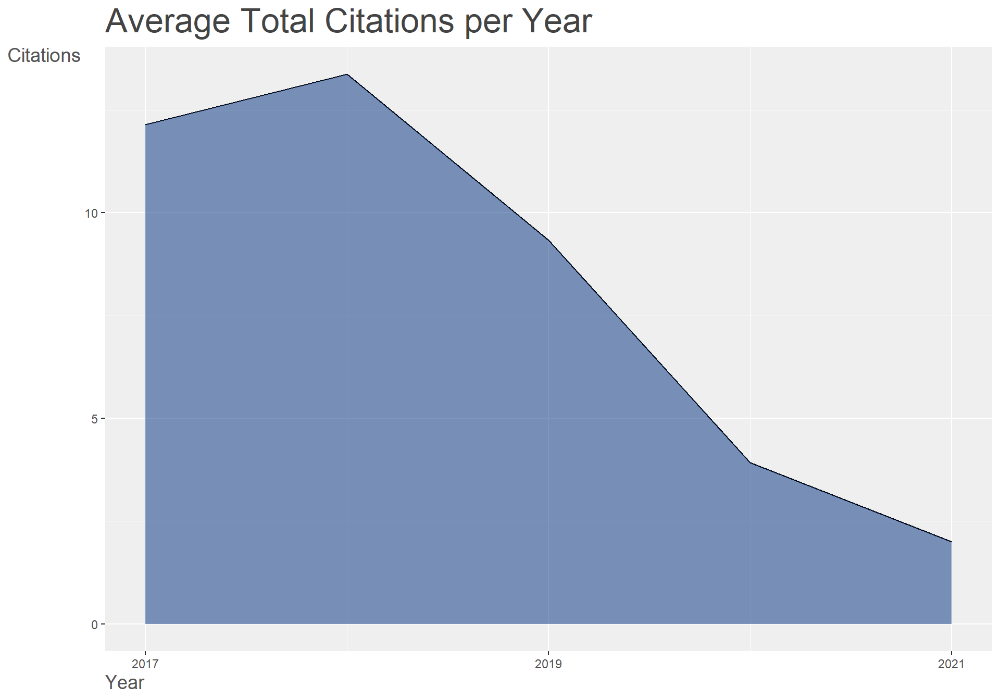

```{r setup, include=FALSE,message=FALSE,error=FALSE}
knitr::opts_chunk$set(echo = FALSE, error=FALSE) #echo=TRUE
knitr::opts_chunk$set(echo = TRUE, message=FALSE,fig.path = "Ecotox_bibliometrix/figs-",fig.width=10,fig.height=7)
```

## Read data
``` {r data_read}
##### See https://www.bibliometrix.org/vignettes/Introduction_to_bibliometrix.html for details of Bibliometrix package
require(bibliometrix) # ver3.1.4
require(ggplot2)
require(tidyverse)

M <- convert2df(c("EES_2019_2020.txt","ET&C_2018_2020.txt"), dbsource = "wos", format = "plaintext")  ## text file was downloaded from Web of Science as plain text file containing full records. download:2021.08.17. Serach by "Environmental Toxicology and Chemistry by "Publication title".

dim(M)
#[1] 2000   62

#### Simple analysis #####
## frequencies of countries ##
results <- biblioAnalysis(M, sep = ";")
plot(x = results, k = 10, pause = FALSE)

```
<!-- -->
<!-- -->
<!-- -->
<!-- -->
<!-- -->
```

# Contries of coresponding authors
results$CO %>% table %>% sort(decreasing=TRUE)
# Country frequency for all authors?  SCP:Single Country Publications, MCP: Multiple Country Publications
results$Country
# Contries of  first author
# identical to the results of corresponding authors?
metaTagExtraction(M, Field = "AU1_CO", sep = ";") %>% dplyr::select(AU1_CO) %>% table %>% sort(decreasing=TRUE)


#### Detailed analysis #####
## frequencies of countries in each journal & year ##
M2 <- M %>% mutate( AU1_CO = metaTagExtraction(M, Field = "AU1_CO", sep = ";") %>% dplyr::select(AU1_CO)  ) %>% #Au1_CO is the country of first author's (or corresponding author?) affiliation. need to be checked.
  as.data.frame

Top5_country <- M2 %>% 
  mutate(AU1_CO=AU1_CO$AU1_CO) %>%
  group_by(SO,PY,AU1_CO) %>% # SO:Journal, PY: Year
  summarize(Country_count = n() ) %>%   # Journal,Year,Country
  top_n(5,Country_count)   #Top5

# plot
Top5_country %>% 
  as.data.frame() %>%
  mutate_at(vars(AU1_CO),as.factor) %>%
  ggplot(aes(x=PY,y=Country_count))+
   facet_grid(~SO)+
   geom_bar(aes(fill=AU1_CO),stat = "identity")
  
```
<!-- -->
```
